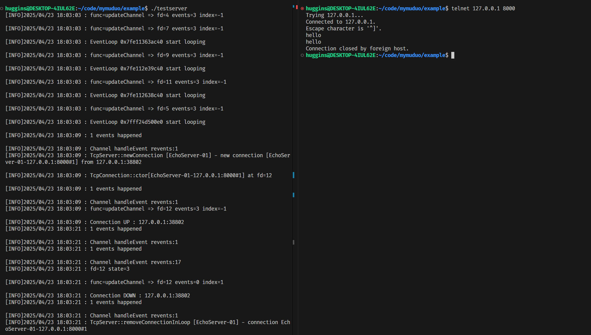
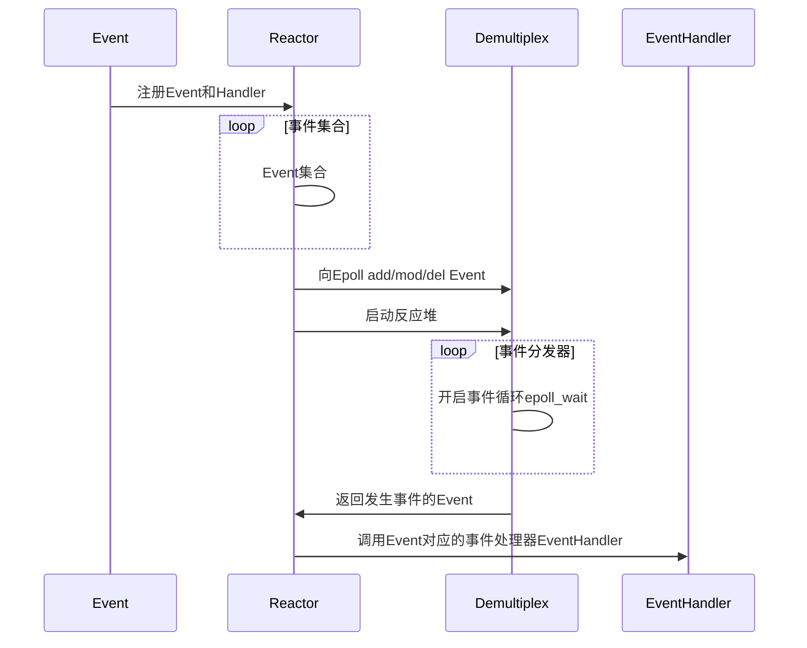
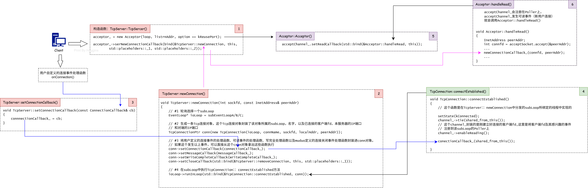
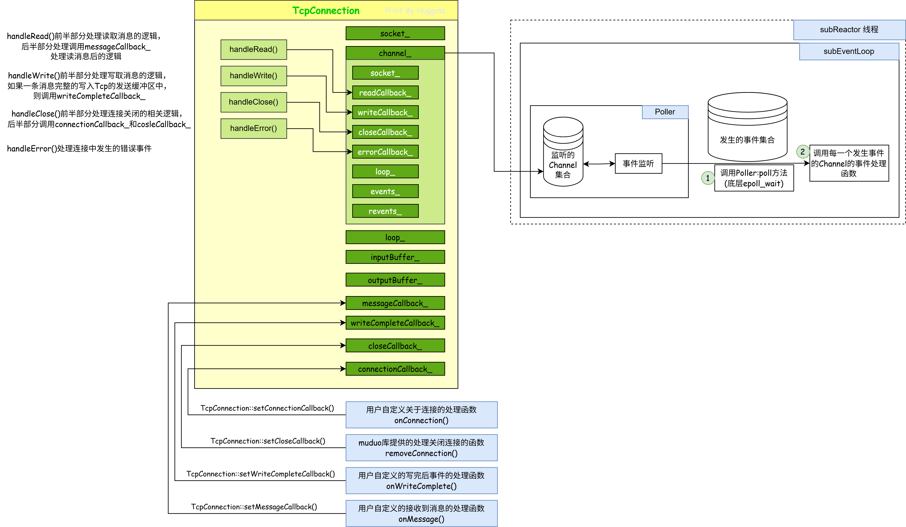
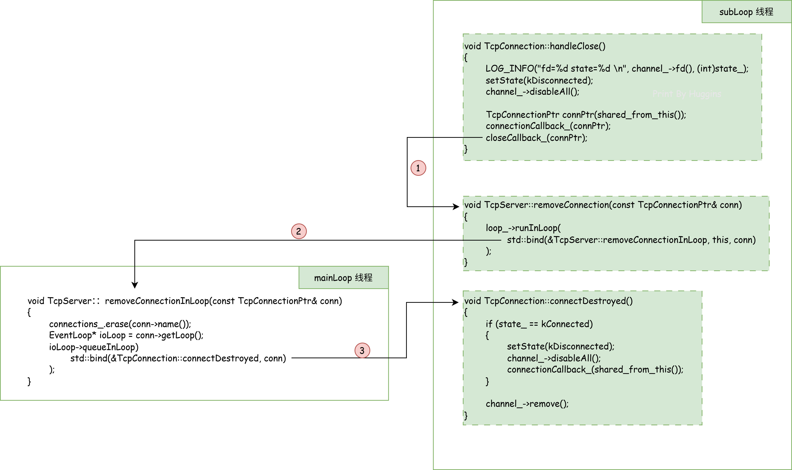
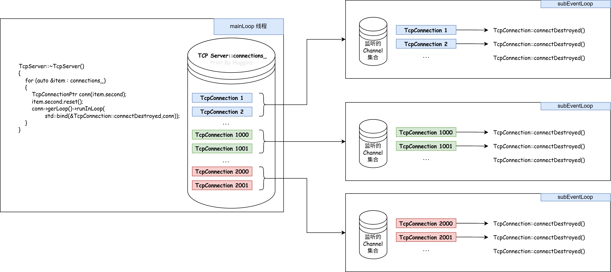

# 项目介绍

本项目是在学习并参考了[Muduo源码](https://github.com/chenshuo/muduo)的基础上，使用了C++11对其进行重构，去除其对Boost库的依赖，并根据Muduo的设计思想，实现了基于多Reactor多线程的网路库。

# 编译指令

下载项目
```
git clone git@github.com:hugginse/mymuduo.git
```

进入mymuduo文件夹
```
cd mymuduo
```

一键编译安装
```
sudo ./build.sh
```

# 运行案例
这里以一个简单的回声服务器为案例，默认监听端口为`8000`
```
cd ./example
./testserver
```

执行情况：



# Reactor模型



# 从使用的角度来理解muduo库

## 简易的echo服务器

```cpp
#include <mymuduo/TcpServer.h>
#include <mymuduo/Logger.h>
#include <string>
#include <functional>

class EchoServer
{
public:
    EchoServer(EventLoop *loop,
            const InetAddress &addr,
            const std::string name)
        : server_(loop, addr, name)
        , loop_(loop)
    {
        // 注册回调函数 将用户定义的连接事件处理函数注册进TcpServer中，TcpServer发生连接事件时会执行onConnection函数
        server_.setConnectionCallback(
            std::bind(&EchoServer::onConnection, this, std::placeholders::_1)
        );

        // 将用户定义的可读事件处理函数注册进TcpServer中，TcpServer发生可读事件时会执行onMessage函数
        server_.setMessageCallback(
            std::bind(&EchoServer::onMessage, this,
                std::placeholders::_1, std::placeholders::_2, std::placeholders::_3)
        );

        // 设置合适的loop线程数量，有3个subLoop
        server_.setThreadNum(3);
    }

    void start()
    {
        server_.start();
    }
private:
    // 连接建立或者断开的回调
    void onConnection(const TcpConnectionPtr &conn)
    {
        if (conn->connected())
        {
            LOG_INFO("Connection UP : %s", conn->peerAddress().toIpPort().c_str());
        }
        else
        {
            LOG_INFO("Connection DOWN : %s", conn->peerAddress().toIpPort().c_str());
        }
    }

    // 可读写事件回调
    void onMessage(const TcpConnectionPtr &conn,
                Buffer *buf,
                Timestamp time)
    {
        std::string msg = buf->retrieveAllAsString();
        conn->send(msg);
        conn->shutdown();       // 关闭的是 写端  EPOLLHUB => closeCallback_
    }

    EventLoop *loop_;
    TcpServer server_;
};

int main()
{
    EventLoop loop;
    InetAddress addr(8000);
    EchoServer server(&loop, addr, "EchoServer-01");        // Acceptor对象 non-blocking listenfd create bind
    server.start();             // listen loopthread listenfd => acceptChannel => mainLoop

    loop.loop();                // 启动mainLoop的底层Poller
    
    return 0;
}

```

主要做了以下几件事：
    
* 建立事件循环器EventLoop：`EventLoop loop;`
* 创建服务器对象，即TcpServer对象：`TcpServer server_;`
* 向TcpServer注册各类事件的用户自定义处理函数：`setConnectionCallback();`、`setMessageCallback();`
* 设置线程数量，若不设置则监听新连接和处理已连接的读写事件都有mainLoop执行
* 启动server：`server.start();`
* 开启事件循环：`loop.loop();`


## 连接建立



$\text{1}$ `TcpServer::TcpServer()`
    
执行代码`TcpSercer server(&loop, listenAddr);`创建一个TcpServer对象，调用TcpServer构造函数。TcpServer的构造函数中实例化了一个`Acceptor对象`，并在这个Accpetor对象注册了一个回调函数(TCP Server::newConnection)

$\text{5}$ `Acceptor::Acceptor()`

在TcpServer的构造函数中实例化一个Acceptor对象时，Acceptor的构造函数中实例化了一个Channel对象(acceptChannel_)，该channel封装了服务器监听套接字文件描述符<font color = "red"> (未注册至mainLoop的事件监听器上)</font>。接着Acceptor构造函数将`Acceptor::handleRead()`方法注册至acceptChannel_中。

如果poller监听到acceptChannel_发生可读事件，就会调用Acceptor::handleRead()

**用户调用server.start()**方法开启TcpServer
```cpp
// ============== TcpServer.cc ============== // 
void TcpSercer::start()
{
    if (started_++ == 0)
    {
        threadPool_->start(threadInitCallback);
        loop_->runInLoop(std::bind(&Acceptor::listen, acceptor_.get()));
    }
} 
// ============== Acceptor.cc ============== // 
void Acceptor::listen()
{
    listenning_ = true;
    acceptSocket_.listen();             // listen 
    acceptChannel_.enableReading();     // acceptChannel_ => Poller acceptChannel_注册至Poller
}
```

调用Acceptor::listen()函数（底层调用linux的`listen()函数`）监听服务套接字，以及accept Channel_注册到mainLoop的事件监听器上监听它的可读事件（新用户连接事件）

`用户调用loop.loop()`方法开启事件监听

该函数会循环获取Poller的监听结果，并且根据监听结果调用注册在Poller上的Channel对象的事件处理函数

$\text{6}$ `Acceptor::handleRead()`

当程序执行到这个函数里，说明acceptChannel_发生可读事件，程序处理新用户的连接请求。该函数首先调用linux的`accpet()函数`接收新用户的连接。接着调用TcpServer::newConnection()函数，这个函数是在`步骤1`中注册给Acceptor并由成员变量newConnectionCallback_保存。

$\text{7}$ `TcpServer::newConnection()`

该函数封装建立好的新连接(TcpConnection对象)，使用轮询算法分发给一个subLoop，并调用TCP Connection::connectEstablished()将TCP Connection::channel_注册到刚刚选择的subLoop的Poller上

## 消息到达


在MainLoop中节后新连接的请求之后，将这条连接封装成`TcpConnection`对象。如图所示，主要封装了已连接的套接字fd（图中socket_，即accept返回的已连接的套接字）、已连接套接字的channel_等。在TcpConnection::TcpConnection()将`handleRead()`、`handleWrite()`、`handlerClose()`以及`handleError()`方法注册进这个channel_内。

当这个TcpConnection对象建立完成之后，mainLoop的Acceptor会通过轮询算法分发给subLoop（将TcpConnection::loop_指针绑定subLoop对象上），并将TcpConnection::channel_注册到subLoop的Poller上。

* 消息读取逻辑

    1. subLoop中的EventLoop::loop()会循环调用`Poller::poll()方法`（底层`epoll_wait`）获取事件监听结果，这个事件监听结果通过一个ChannelList来维护，每一个Channel封装者一个fd、fd感兴趣的事件和Poller监听到该fd实际发生的事件。
    
    2. 当一个channel感兴趣的事件发生，则执行提前注册至channel内部的事件处理函数:<font color = "red">`readCallback_`</font>、`writeCallback_`、`closeCallback_`和`errorCallback_`

`readCallback_`保存的就是TcpConnection::handleRead()，该函数提供了消息读取的处理逻辑
```cpp
void TcpConnection::handleRead(Timestamp receiveTime)
{
    int saveErrno = 0;
    ssize_t n = inputBuffer_.readFd(channel_->fd(), &saveErrno);
    if (n > 0)
    {
        // 已建立连接的用户, 有可读的事件发生了, 调用用户传入的回调操作onMessage
        messageCallback_(shared_from_this(), &inputBuffer_, receiveTime);
    }
    else if (n == 0)
    {
        handleClose();
    }
    else
    {
        errno = saveErrno;
        LOG_ERROR("TcpConnection::handleRead");
        handleError();
    }
}
```
该函数首先调用`Buffer_.readFd(channel_->fd(), &saveErrno)`（该函数底层调用`readv()`），将TCP接收缓冲区的数据拷贝到用户自定义的缓冲区中（inputBuffer_）。在数据拷贝过程中如果发生了错误，则错误信息就会保存在saveErrno中
> * readFd()返回值>0，说明从接收缓冲区读取到了数据，节后调用messageCallback_中保存的用户自定义的读取消息后的处理函数
> * read()返回值=0，说明客户端连接关闭，此时调用TcpConnection::handleClose()来处理连接关闭事件
> * read()返回值<0，说明发生错误，调用TcpConnection::handleError()来处理saveErrno的错误事件。

## 消息发送

当用户调用TcpConnection::send(buf)函数时，相当于要求muduo库把数据buf发送给该Tcp连接的客户端。此时该TcpConnection注册在Poller上感兴趣的事件中是没有可写事件的。

* 如果Tcp发送缓冲区能一次性容纳buf，那么write()函数将buf的数据全部拷贝到发送缓冲区中

* 如果Tcp发送缓冲区不能一次性容纳buf数据

    * write()函数尽可能的将buf数据拷贝至Tcp发送缓冲区中，并将errno设置为EWOULDBLOCK

    * 剩余未拷贝到Tcp发送缓冲区的buf数据被存放在TcpConnection::outputBuffer_中。并向Poller上注册该TcpConnection::channel_的可写事件

    * Poller监听到该Tcp连接可写事件，调用`TcpConnection::handleWrite()`函数把`TcpConnection::outputBuffer_`的数据发送出去

    * 在`TcpConnection::handleWrite()`函数中，通过调用`outputBuffer_.writeFd()`方法将outputBuffer_中的数据写入到Tcp的发送缓冲区。如果Tcp发送缓冲区依旧没法容纳剩余的未发送数据，那就尽可能地将数据拷贝到Tcp发送缓冲区，继续保持可写事件的监听

当数据全部拷贝到Tcp发送缓冲区之后，就会调用`用户自定义的[写完事件处理函数]`，并且移除该TcpConnection在Poller上的可写事件。（移除可写事件是为了提高效率，不会让epoll_wait()频繁触发可写事件）

## 连接断开

### 连接被动断开

服务端TcpConnection::handleRead()中感知到客户端把连接断开了。`TcpConnection::handleRead()=>inputBuffer_.readFd()=>readv()`函数调用Linux函数`readv()`，当readv()返回**0**时，服务端就能感知到客户端断开了连接，然后调用`TcpConnection::handleClose()`。



1. 在执行`TcpConnection::handleClose()`的时候，该函数中在`subLoop`线程中运行，接着调用`close Callback_(connPtr)`函数，该函数保存的是`TcpConnection::removeConnection()`函数

2. `TcpConnection::removeConnection()`函数调用了`mainLoop`线程中的`TcpServer::removeConnectionInLoop`函数

3. `TcpServer::removeConnectionInLoop`：TcpServer对象中存在一个保存所有连接的unordered_map表（connections_），由于这个Tcp连接要关闭，因此要把这个TcpConnection对象从connections_中删除。接着调用`TcpConnection::connectDestroyed`函数。
    > 为什么removeConnectionInLoop()要在mainLoop中运行，因为该函数的逻辑是从TcpServer对象中删除某条数据，而TcpServer对象属于mainLoop。`one Loop per thread理念`

4. `TcpConnection::connectDestroyed()`：该函数是将Tcp连接的监听描述符从Poller中移除。subLoop中的Poller对象中还保存着这条Tcp连接的channel_，调用`channel_.remove()`将这条Tcp连接的channel对向从Poller内的数据结构中删除

### 服务器主动关闭导致连接断开

当服务器主动关闭时，调用`TcpServer::~TcpServer()`析构函数。



`TcpServer::~TcpServer()`不断循环的让TcpConnection对象所属的subLoop线程执行`TcpConnection::connectDestroyed()`函数，同时在mainLoop的`TCP Server::~TcpServer()`函数中调用`item.second.reset()`释放保管TcpConnection对象的共享智能指针，以释放TcpConnection对象的堆内存空间

```cpp
TcpServer::~TcpServer()
{
    for (auto& item : connections_)
    {
        // 这个局部的shared_ptr智能指针对象, 出右括号, 可以自动释放new出来的TcpConnection对象资源
        TcpConnectionPtr conn(item.second);     
        item.second.reset();

        // 销毁连接
        conn->getLoop()->runInLoop(
            std::bind(&TcpConnection::connectDestroyed, conn)
        );
    }
}
```

* 首先`TcpServer::connections_`是一个`unordered_map<string, TcpConnectionPtr>`，其中TcpConnectionPtr的含义是指向TcpConnection的shared_ptr

* 每一个TcpConnection对象都被一个共享智能指针TcpConnectionPtr管理，当执行`TcpConnectionPtr conn(item.second);`时，这个TcpConnection对象就被con和这个item.second共同管理，但是这个conn声明周期在for循环出**}**后结束，

* 接着调用`item.second.reset()`释放掉TcpServer中保存该TcpConnection对象的智能指针。此时，剩下conn管理这个TcpConnection对象，因此当前TcpConnection对象还不会被析构

* 然后执行`conn->getLoop()->runInLoop(std::bind(&TcpConnection::connectDestroyed, conn));`。其含义是让subLoop线程去执行`TcpConnection::connectDestroyed()`函数。当`conn`这个参数被传入的时候，conn的引用计数`+1`。因为传给subLoop的不只有函数，还有这个函数所属的conn对象

* subLoop线程执行`TcpConnection::connectDestroyed()`函数

* mainLoop线程的一轮for循环执行完毕，conn离开代码块，因此被析构，但是TcpConnection对象还不会被释放，因为还有一个共享指针指针指向这个TcpConnection对象，这个指针在`TcpConnection::connectDestroyed()`函数中，其存在形式是一个隐式的this。当这个函数执行完毕之后，这个智能指针被释放。此时TcpConnection对象的引用计数变为0，该TcpConnection对象被析构。

# 致谢

* [作者-陈硕][https://github.com/chenshuo/muduo](https://github.com/chenshuo/muduo)
* 《Linux高性能服务器编程》
* 《Linux多线程服务端编程：使用muduo C++网络库》